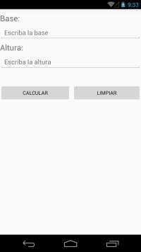

# Proyecto
Área del Triángulo

# Descripción
- El repositorio contiene código fuente de *Android, iOS y WP* para calcular el área de un triángulo utilizando la fórmula anterior.
- Vea los enlaces en **Recursos adicionales** para comprender como realizar el cálculo y visualizar algunos ejemplos.

# Objetivos
- Comprender los conceptos de *Entrada (E), Proceso (P) y Salida (S)*.
- Analizar como se soluciona un problema utilizando Xamarin.

# Recursos adicionales
- Conceptos básicos sobre triángulos y como calcular el área. [Ver](http://www.ditutor.com/geometria/area_triangulo.html).
- Universo de fórmulas. [Ver](http://www.universoformulas.com/matematicas/geometria/area-triangulo/).

# Solución
## Android

## Windows Phone

